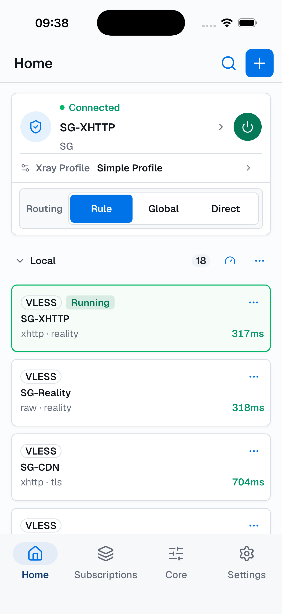
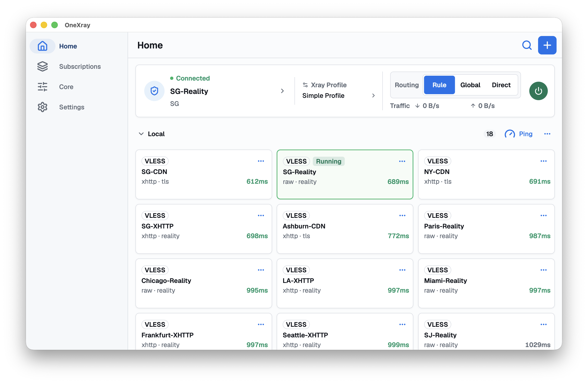

<p align="center">
  
</p>

<h1 align="center">OneXray</h1>

<p align="center">
  面向自有节点、订阅与配置的私密跨平台 Xray-core 客户端。
</p>

<p align="center">
  <a href="https://github.com/OneXray/OneXray/releases/latest"></a>
  <a href="../LICENSE"></a>
  
</p>

<p align="center">
  <a href="https://onexray.com">文档站</a> ·
  <a href="./FIRST_RUN.zh_CN.md">开发环境</a> ·
  <a href="https://t.me/OneXrayApp">Telegram</a> ·
  <a href="https://github.com/OneXray/OneXray/releases/latest">版本发布</a>
</p>

<p align="center">
  <a href="../README.md">English</a> · 简体中文 · <a href="./README.ru.md">Русский</a>
</p>

OneXray 支持导入您自己的兼容服务器配置或 HTTPS 订阅，并通过结构化 Xray 配置与路由工具管理节点和流量。

OneXray 仅提供客户端，不提供 VPN/代理服务器、订阅或网络服务。App 无需账户，不包含广告、Analytics、Tracking、Telemetry 或崩溃上报服务。

## 界面预览

<p align="center">
  
  &nbsp;&nbsp;
  
</p>

## 核心能力

- **跨平台 TUN**：支持 iOS、macOS、Android、Windows 和 Linux。
- **灵活配置**：提供简易配置、可复用 Xray 配置、Full Config 和 Raw JSON。
- **路由控制**：可在 Home 切换规则、全局和直连模式。
- **导入与管理**：通过二维码、图片、文件或剪贴板导入受支持的分享链接与 HTTPS 订阅。
- **本地工具**：节点 Ping、Xray 日志、GeoData 与规则集管理、备份和恢复。
- **平台集成**：Android Per-App VPN、Apple On Demand、桌面托盘控制和出站网卡选择。

## age 加密订阅

添加或编辑 HTTPS 订阅时，可在“加密”区域填写已有 age 密钥对，或选择生成
X25519、Mihomo 兼容的 Hybrid（`ML-KEM-768 + X25519`）密钥。OneXray 只通过
`X-Age-Public-Key` 发送已保存的公钥；私钥仅保存在本地，密钥对会在自动更新
订阅时复用。

订阅仍必须使用 HTTPS。OneXray 备份文件未加密，并会包含 age 密钥对，以保证恢复后
订阅仍可用；请妥善保管备份 ZIP 文件。

## OneXray URL Scheme

OneXray 可通过专有的 `onexray://` URL 分享和导入内容：

```text
onexray://onexray.com/config/add?type=outbound|profile|full|raw&data=<经过百分号编码的-base64-json>#名称
onexray://onexray.com/sub/add?url=<经过百分号编码的-https-url>[&age=x25519|hybrid]#名称
onexray://onexray.com/dat/add?type=domain|ip&url=<经过百分号编码的-https-url>#名称
```

分享的配置引用了 OneXray 中已有的自定义 GeoData 时，对应 GeoData 链接会排列在
配置链接之前。

仅支持上面列出的类型，不接受旧版 `type=setting`、备份或其他命令。导入 age
订阅链接时，App 会生成一对新的本地密钥，首次下载只发送公钥，并在订阅成功
导入后保存密钥对。

Android、iOS 和已安装的 macOS App 会直接注册该协议。Windows 和 Linux
请使用 EXE/winget 或 DEB 包；ZIP 包不会自动注册协议。Mac App Store 版本与
OneXraySE 使用相同协议，同时安装时 macOS 可能选择其中任意一个处理链接。

## 下载

| 平台 | 要求 | 下载 |
| --- | --- | --- |
| iOS | iOS 15.0 及以上，arm64 | [App Store](https://apps.apple.com/us/app/onexray/id6745748773)、[IPA](https://github.com/OneXray/OneXray/releases/latest/download/OneXray-ios.ipa) |
| macOS（Mac App Store） | macOS 13.0 及以上，Apple silicon 或 Intel | [App Store](https://apps.apple.com/us/app/onexray/id6745748773) |
| macOS（商店外分发） | macOS 13.0 及以上，Apple silicon 或 Intel | Homebrew：`brew install --cask onexrayse`、[Universal ZIP](https://github.com/OneXray/OneXray/releases/latest/download/OneXray-macos-universal.zip) |
| Android | Android 10.0 及以上，arm64-v8a 或 x86_64 | [Google Play](https://play.google.com/store/apps/details?id=net.yuandev.onexray)、[Universal APK](https://github.com/OneXray/OneXray/releases/latest/download/OneXray-android-universal.apk) |
| Windows x86_64 | Windows 10 或 Windows 11 | winget：`winget install --id YuanDevLLC.OneXray -e`、[EXE](https://github.com/OneXray/OneXray/releases/latest/download/OneXray-windows-amd64.exe)、[ZIP](https://github.com/OneXray/OneXray/releases/latest/download/OneXray-windows-amd64.zip) |
| Windows ARM64 | Windows 11 | winget：`winget install --id YuanDevLLC.OneXray -e`、[EXE](https://github.com/OneXray/OneXray/releases/latest/download/OneXray-windows-arm64.exe)、[ZIP](https://github.com/OneXray/OneXray/releases/latest/download/OneXray-windows-arm64.zip) |
| Linux x86_64 | GLIBC >= 2.39 | [DEB](https://github.com/OneXray/OneXray/releases/latest/download/OneXray-linux-x86_64.deb)、[ZIP](https://github.com/OneXray/OneXray/releases/latest/download/OneXray-linux-x86_64.zip) |
| Linux arm64 | GLIBC >= 2.39 | [DEB](https://github.com/OneXray/OneXray/releases/latest/download/OneXray-linux-aarch64.deb)、[ZIP](https://github.com/OneXray/OneXray/releases/latest/download/OneXray-linux-aarch64.zip) |

## 安装说明

### macOS

Mac App Store 版本是单独的商店包。Homebrew 与 Universal ZIP 使用同一个 Developer ID `macos_se` 包，安装的 App 为 `OneXraySE.app`。

```shell
brew install --cask onexrayse
brew uninstall --cask onexrayse
```

#### Universal ZIP

1. 下载并解压 `OneXray-macos-universal.zip`。
2. 将 `OneXraySE.app` 移动到 `/Applications`（“应用程序”）目录。不要直接从“下载”目录或其他目录运行；macOS 要求包含 System Extension 的 App 安装在系统的“应用程序”目录中。
3. 从“应用程序”目录打开 OneXraySE，并确认 macOS 的首次打开提示。

首次连接 VPN：

1. 导入订阅或节点，选中节点，然后点击启动。
2. 打开“系统设置 > 通用 > 登录项与扩展”。
3. 在“扩展”区域打开“网络扩展”，启用 OneXraySE，然后点击“完成”。
4. 如果“隐私与安全性”页面也显示批准请求，请点击“允许”；系统要求重启时请重启 Mac。
5. 返回 OneXraySE，再次点击启动。

更新 ZIP 版本时，请先退出 OneXraySE，再用新解压的 `OneXraySE.app` 替换 `/Applications` 中的旧版本并重新打开。如果 macOS 要求批准 System Extension 更新，请按提示操作。

参阅 [Installing System Extensions and Drivers](https://developer.apple.com/documentation/systemextensions/installing-system-extensions-and-drivers) 和 [更改“登录项与扩展”设置](https://support.apple.com/guide/mac-help/change-login-items-extension-settings-mtusr003/mac)。

### Windows

Winget 会根据当前设备架构自动选择 x86_64 或 ARM64 安装包。

```shell
winget install --id YuanDevLLC.OneXray -e
winget uninstall --id YuanDevLLC.OneXray -e
```

### Android

Android 版本支持 `arm64-v8a` 与 `x86_64`，不支持 32 位 ARM 设备。

### iOS

若您的 Apple ID 无法使用 App Store，可下载 `OneXray-ios.ipa`，并通过 [AltStore](https://altstore.io/) 或其他兼容的侧载工具安装。

自行安装 IPA 时，必须使用授权 Network Extension capability 的 provisioning profile，重新签名 OneXray 主 App 与 Packet Tunnel extension。Apple 不向免费的 Personal Team 账号提供该 capability，因此必须加入付费 Apple Developer Program。否则 App 可能可以打开并进行节点测速，但无法启动 VPN。参阅 [Apple Developer Forums](https://developer.apple.com/forums/thread/128767) 和 [iOS 支持的能力](https://developer.apple.com/help/account/reference/supported-capabilities-ios/)。

### Linux

使用 DEB 包：

```shell
sudo apt install ./OneXray-linux-x86_64.deb
sudo apt remove onexray
```

使用 ZIP 包时，请在包含 `OneXray` 的目录中执行：

```shell
sudo apt install -y procps libcap2-bin libayatana-appindicator3-1
sudo setcap cap_net_admin,cap_net_raw+eip OneXray/bin/OneXrayCore
```

GNOME 用户需要安装 [AppIndicator](https://github.com/ubuntu/gnome-shell-extension-appindicator) 扩展。Linux arm64 当前会将 CJK 界面语言回退为英文。

## 参与贡献

欢迎通过以下方式参与：

1. 为本仓库点亮 Star。
2. 完善 [OneXray 文档](https://github.com/OneXray/onexray.com)。
3. 通过 [OneXray/Routing](https://github.com/OneXray/Routing) 分享路由模板。

本地构建 App 前，请先阅读[开发环境配置](./FIRST_RUN.zh_CN.md)。

## 许可证

OneXray 使用 [GNU General Public License v3.0](../LICENSE)。
